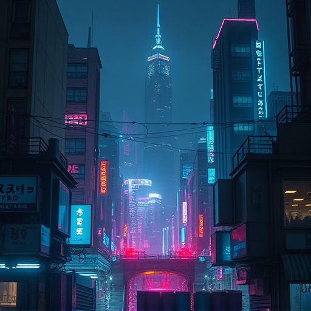
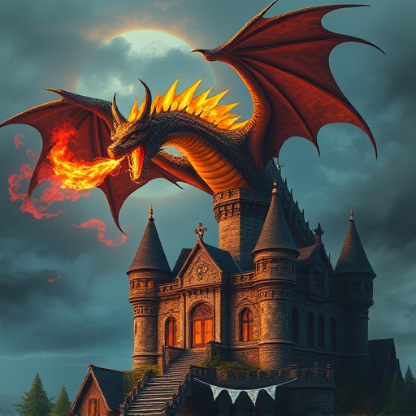

# 🪄 Open Fantasia — Local Image Generation

Generate images locally on your GPU using FLUX.1-schnell or Stable Diffusion — no external API, no cost per image.

[](https://firstdonoharm.dev/version/3/0/law-mil-sv.html)


---

## Gallery

| Prompt | Result |
|--------|--------|
| `a cat astronaut on the moon` |  |
| `a samurai cat at sunset` |  |
| `cyberpunk city at night` |  |
| `a dragon breathing fire over a medieval castle` |  |

*Generated locally with FLUX.1-schnell, low quality preset. Speed varies by GPU.*

---

## Features

- 🚀 **Local generation** — no API keys, no cloud, no per-image cost
- ⚡ **FLUX.1-schnell** — fast distilled model, great quality
- 🌸 **FLUX.2-klein** — lighter experimental model
- 🎨 **Stable Diffusion 1.5** — classic fallback, runs on 6GB VRAM
- ⚡ **SD-Turbo** — near-instant generation (~1-3s at 512×512)
- 🔢 **Batch generation** — generate 1–4 images per prompt (different seeds)
- 💬 **OpenClaw slash command** — `/fantasia <prompt>` with inline buttons
- 🔁 **Persistent server** — model stays in VRAM, near-instant after first load

---

## Requirements

- Python 3.10+
- CUDA GPU — **8GB VRAM minimum** (16GB recommended for FLUX)
- [HuggingFace account](https://huggingface.co) + `HF_TOKEN` in `.env` (see `.env.example`)
- ~16GB disk space for FLUX.1-schnell (downloaded once)

---

## Quick Start

```bash
git clone https://github.com/fabiopacifici-bot/open-fantasia-imagegen
cd open-fantasia-imagegen
cp .env.example .env   # add your HF_TOKEN
bash setup.sh
```

`setup.sh` will:
1. Create a Python venv and install dependencies
2. Download the recommended model (~16GB, one-time)
3. Install and enable the systemd service
4. Start the server at `http://localhost:8765`

---

## Usage

### Via OpenClaw slash command (recommended)

```
/fantasia a samurai cat at sunset
/fantasia cyberpunk city --quality high
/fantasia quick sketch --quality low --count 3
/fantasia portrait --model klein
/fantasia setup        ← first-time setup
```

**Inline buttons:** Call `/fantasia` with no prompt to get model/quality/count selection buttons.

### Direct API

```bash
# Generate an image
curl -X POST http://localhost:8765/generate \
  -H "Content-Type: application/json" \
  -d '{"prompt": "a cat in space", "quality": "low", "enhance": true, "count": 1}'

# Health check
curl http://localhost:8765/health
```

### CLI

```bash
.venv/bin/python src/imagegen.py \
  --prompt "a samurai cat at sunset" \
  --quality low \
  --output output.png
```

---

## Quality Presets

| Preset | Resolution | Steps | Approx. Speed       |
|--------|-----------|-------|---------------------|
| `low`  | 512×512   | 4     | ~1-5 min (GPU dependent)  |
| `mid`  | 768×768   | 8     | ~3-10 min (GPU dependent) |
| `high` | 1024×1024 | 20    | ~10-20 min (GPU dependent)|

> **Note:** Speed varies significantly by GPU. FLUX runs in BF16 precision. Use torchao autoquant to reduce VRAM usage and improve throughput.

---

## Models

| Flag | Model | VRAM | Notes |
|------|-------|------|-------|
| `schnell` (default) | `black-forest-labs/FLUX.1-schnell` | ~16GB | Best quality, BF16 precision |
| `klein` | `black-forest-labs/FLUX.2-klein-base-9B` | ~16GB | Experimental, lighter |
| `sd15` | `stable-diffusion-v1-5/stable-diffusion-v1-5` | ~4GB | Fast, classic |
| `turbo` | `stabilityai/sd-turbo` | ~4GB | Near-instant, ~1-3s at 512×512 |

---

## Server Management

```bash
# Start / stop / restart
systemctl --user start fantasia.service
systemctl --user stop fantasia.service
systemctl --user restart fantasia.service

# Status & logs
systemctl --user status fantasia.service
journalctl --user -u fantasia.service -f
```

Output images are saved to `~/.openclaw/media/fantasia/`.

---

## Project Structure

```
open-fantasia-imagegen/
├── src/
│   ├── server.py       # FastAPI inference server
│   └── imagegen.py     # Pipeline loader + generation logic
├── assets/             # README demo images
├── setup.sh            # First-time setup script
├── .env.example        # Environment variable template
├── requirements.txt
└── .specs/             # Plans, docs, debugging notes
```

---

## License

MIT

## Roadmap

### v1.3 — Turbo mode ✅
- `sd-turbo` available as `--model turbo` (stabilityai/sd-turbo)
- ~1-3s generation at 512×512 on CUDA

### v2.0 — Image Editing
- Instruction-based image editing via **Qwen2.5-VL**
- New endpoint: `POST /edit` — `{ "image": "<path>", "instruction": "make the sky purple" }`
- Slash command: `/fantasia edit <image> <instruction>`
